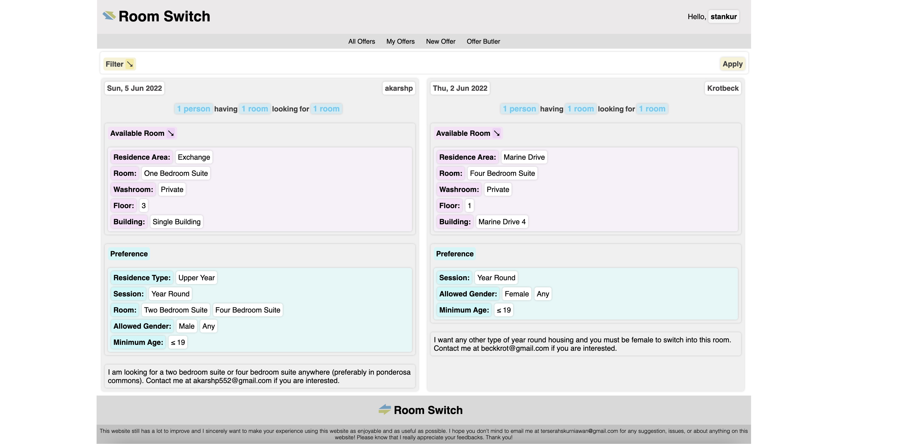
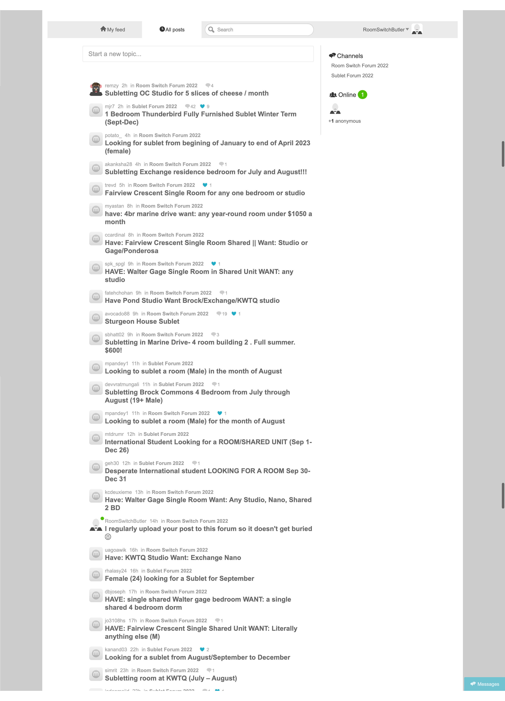
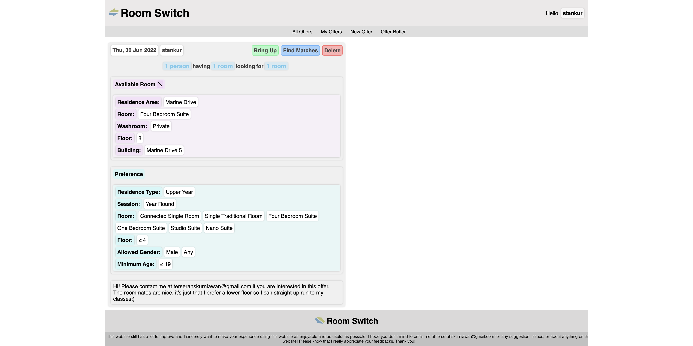
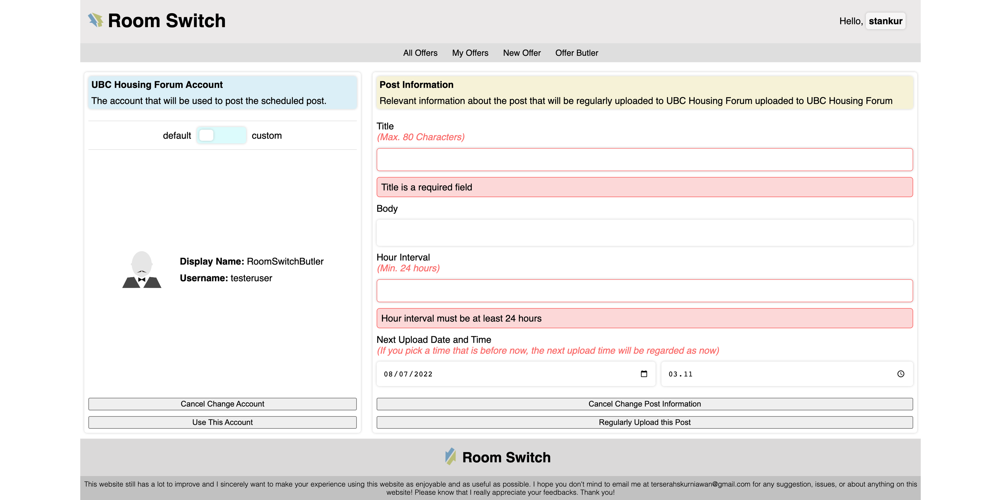

# Room Switch Forum

## To simplify the way UBC students get the room they want

 

    

 

## Summary

The main principles of the decisions made for this project are:

<li>Keep offers discoverable</li>
<li>Make finding matches easy</li>

 

The products of these principles are Room Switch Forum and Offer Butler.

Room Switch Forum provides a common structure for offers which enables us to create a filter feature where users can see offers matching different criterias. When a user has listed an offer, finding matches to their specified preferences is very fast and takes no more than two clicks from anywhere in the website.

The Offer Butler uploads posts at a regular interval of users' own choice to [UBC Housing Forum](https://forums.housing.ubc.ca/) to keep them from getting buried and remain discoverable to new visitors.

## Problem

UBC has actually provided a forum ([UBC Housing Forum](https://forums.housing.ubc.ca/)) for room exchanges, but this forum is not specifically tailored to facilitate room exchange. The posts in the forum are simple texts with no common structure and only newer posts are visible. This makes it hard for new users to find older posts which are still open. Once a user's post gets buried, if the user's post is not a room which is in a highly sought after area, the user will be left with no chance for room exchange.

    

## Solution

The Room Switch Forum gives a common structure for all offers to make it suitable for us to do programatical manipulations to help users keep their offers discoverable. Keeping offers from getting buried also only takes no more than two clicks with the "Bring Up" feture shown below.

 

    

 

The Offer Butler keeps posts from getting buried and remain discoverable in [UBC Housing Forum](https://forums.housing.ubc.ca/) by uploading posts at a regular basis to the forum while still respecting the forum by limiting the post upload interval to 3 hours.

 

    

 

## Get Started

Visit this [project's website](https://room-switch.herokuapp.com/) to see the various features available and try creating an account!

## Relevant Links

[This project's backend](https://github.com/stankur/Room-Switch-Forum)

[Public part of Offer Butler](https://github.com/stankur/forum-bot-runner)

[The Backend of Offer Butler]() (still not available since it contains an unprotected POST route)
